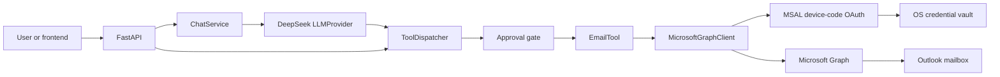

# Mona — Project Context for AI Assistants

This is the concise handoff document for Mona. Read this file, `README.md`, and the relevant files in `docs/` before changing the project. Keep this document current after material architecture, setup, security, or workflow changes.

## Project identity

- **Name:** Mona
- **Purpose:** An extensible, tool-based personal AI assistant.
- **Current phase:** Local Phase 1 implementation and first Outlook email-chat setup.
- **Repository:** `C:\Users\kummaris.S-TKP-LTP-0343\OneDrive\M4rinqu3ll_GitHub_Repos\Mona_AI_Assistant`
- **Primary language/runtime:** Python 3.12+
- **API framework:** FastAPI
- **Initial LLM provider:** DeepSeek
- **Initial external tool:** Outlook email through Microsoft Graph

## User goals and preferences

- Build Mona incrementally and explain setup one short step at a time.
- Keep explanations beginner-friendly and map unfamiliar Microsoft services to simple concepts.
- Outlook email is the first connector, but the architecture must remain extensible.
- Store learning notes in `Notes.md`.
- Never place Mona files back in the previous corporate OneDrive `Documents\AI Assistant` folder.
- Keep sensitive information out of Git.

## Architecture



Design boundaries:

- The LLM reasons but does not receive credentials or call Microsoft Graph directly.
- `ToolDispatcher` validates and routes tool calls and enforces the approval boundary.
- Tools own business actions; clients own external API details.
- Mutating email actions require explicit approval by default.
- Graph responses and tool outputs should be bounded to the requested data.

## Implemented components

- MSAL device-code authentication with token cache stored through the OS credential vault.
- Async Microsoft Graph client with timeouts, retries, bounded responses, and structured errors.
- Generic `BaseTool` and `ToolDispatcher`.
- `EmailTool` actions for unread, read, search, send, reply, mark-read, and attachments.
- FastAPI endpoints for health, tools, direct tool calls, chat, and device-code authentication.
- Provider-neutral `LLMProvider` with DeepSeek and OpenAI implementations.
- Provider-neutral memory interface; durable long-term memory is not implemented yet.
- Structured logging and an automated test suite.

## Important files

- `README.md` — Project overview, installation, API examples, and security notes.
- `Notes.md` — Beginner-friendly concepts and the live setup checklist.
- `docs/architecture.md` — Detailed architecture.
- `docs/development.md` — Development workflow.
- `docs/first-email-chat.md` — First-run email-chat walkthrough.
- `docs/roadmap.md` — Planned phases.
- `agent/app.py` — FastAPI application and endpoints.
- `agent/config.py` — Environment-driven configuration.
- `agent/services/chat.py` — LLM/tool reasoning loop.
- `agent/auth/microsoft.py` — Microsoft device-code authentication.
- `agent/clients/graph.py` — Microsoft Graph client.
- `agent/dispatcher/dispatcher.py` — Tool routing and approval control.
- `agent/tools/base.py` — Base tool contract.
- `agent/tools/email/tool.py` — Outlook email tool.
- `agent/llm/deepseek_provider.py` — DeepSeek integration.
- `.env.example` — Safe configuration template; contains no real secrets.

## Local configuration

Real values belong only in `.env`, which must remain ignored by Git. Required configuration for the first email chat includes:

```dotenv
MS_CLIENT_ID=<Microsoft Entra application/client ID>
MS_TENANT_ID=common
MS_SCOPES=User.Read,Mail.ReadWrite,Mail.Send

LLM_PROVIDER=deepseek
DEEPSEEK_API_KEY=<local secret; never commit>
DEEPSEEK_MODEL=deepseek-v4-flash
DEEPSEEK_BASE_URL=https://api.deepseek.com
DEEPSEEK_THINKING=false
```

Never read, print, copy into documentation, or commit the user's real `.env` values. A Microsoft client ID and tenant ID are identifiers rather than passwords, but they should still be handled deliberately. Access tokens, refresh tokens, client secrets, and API keys are secrets.

## Microsoft setup model

- **Azure account:** Provides access to the Azure portal. Mona's local authentication does not require consuming the trial credit.
- **Microsoft Entra ID:** Identity service, formerly Azure Active Directory.
- **App registration:** Gives Mona its Microsoft application/client ID.
- **Device-code OAuth:** The user signs in in a Microsoft browser page; Mona never handles the Outlook password.
- **Microsoft Graph:** API used for permitted Outlook actions.
- **Required delegated permissions:** `User.Read`, `Mail.ReadWrite`, and `Mail.Send`.
- **Public client:** Enable public client flows; do not create or use a client secret for this local device-code application.

## Current setup status — 2026-07-31

- The user has a personal Outlook account.
- The user has a DeepSeek API key configured locally.
- The user created an Azure free account and received the trial credit.
- The default Microsoft Entra tenant is accessible. The user renamed its display name from `Default Directory`; the new name was not recorded in chat.
- The Mona app registration was created with account type `Any Entra ID Tenant + Personal Microsoft accounts`.
- Mona's `Allow public client flows` setting is enabled for device-code authentication.
- Microsoft Graph delegated permissions `User.Read`, `Mail.ReadWrite`, and `Mail.Send` are configured.
- Mona's Application (client) ID is configured locally in `.env`, and `MS_TENANT_ID=common` is set.
- The DeepSeek API key is present locally and `LLM_PROVIDER=deepseek` is configured.
- The earlier Microsoft error occurred before the Azure account/tenant setup was complete.
- **Next action:** Start Mona locally with `.\.venv\Scripts\python.exe -m uvicorn agent.app:app --reload`, leave that terminal running, and open `http://127.0.0.1:8000/docs`.
- After that: authenticate through device code and run the first read-only email test.

## Development commands

```powershell
uv sync --extra dev
uv run uvicorn agent.app:app --reload
uv run ruff check .
uv run mypy agent
uv run pytest
```

Interactive API documentation is available locally at `http://127.0.0.1:8000/docs` while the server is running.

## Security and change rules

- Preserve `.gitignore` protections for `.env`, virtual environments, caches, credentials, tokens, and generated local data.
- Do not commit `.env` or secrets, even temporarily.
- Do not add a Microsoft client secret to the device-code flow.
- Do not enable `AUTO_APPROVE_TOOLS=true` unless the user explicitly accepts the risk in a trusted local environment.
- Keep Mona bound to localhost until API authentication and durable approval storage are implemented.
- Treat mailbox content and Graph payloads as untrusted input.
- Before pushing, check `git status`, inspect the diff, and scan tracked files for accidental secrets.
- Make focused changes and preserve unrelated user work.

## Guidance for the next AI assistant

1. Read this file and `Notes.md` to understand the current state.
2. Verify the repository state instead of assuming a checklist item is complete.
3. Continue from the single **Next action** above.
4. Guide the user one concise step at a time and wait for confirmation between Microsoft portal steps.
5. Update the setup status and next action in both context documents after each completed milestone.
6. Never request that the user paste an API key, OAuth token, password, or client secret into chat.
