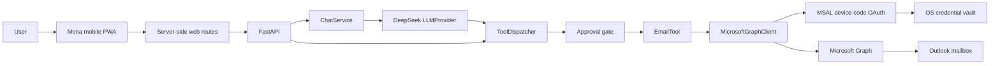

# Mona — Project Context for AI Assistants

This is the concise handoff document for Mona. Read this file, `README.md`, and the relevant files in `docs/` before changing the project. Keep this document current after material architecture, setup, security, or workflow changes.

## Project identity

- **Name:** Mona
- **Purpose:** An extensible, tool-based personal AI assistant.
- **Current phase:** Private mobile companion implementation, building on the verified local Outlook workflow.
- **Repository:** `C:\Users\kummaris.S-TKP-LTP-0343\OneDrive\M4rinqu3ll_GitHub_Repos\Mona_AI_Assistant`
- **Primary language/runtime:** Python 3.12+
- **API framework:** FastAPI
- **Initial LLM provider:** DeepSeek
- **Initial external tool:** Outlook email through Microsoft Graph

## User goals and preferences

- Build Mona incrementally and explain setup one short step at a time.
- Keep explanations beginner-friendly and map unfamiliar Microsoft services to simple concepts.
- Outlook email is the first connector, but the architecture must remain extensible.
- Store learning notes in `Notes.md`.
- Never place Mona files back in the previous corporate OneDrive `Documents\AI Assistant` folder.
- Keep sensitive information out of Git.

## Architecture



Design boundaries:

- The LLM reasons but does not receive credentials or call Microsoft Graph directly.
- `ToolDispatcher` validates and routes tool calls and enforces the approval boundary.
- Tools own business actions; clients own external API details.
- Mutating email actions require explicit approval by default.
- Graph responses and tool outputs should be bounded to the requested data.

Approval trust boundary:

- The LLM may propose a structured tool call, but it cannot approve or directly execute a mutating action.
- The dispatcher returns `PENDING_APPROVAL` with the proposed parameters for user review.
- In the current Phase 1 API, the exact reviewed call is manually resubmitted to `/tool` with `approval_status=APPROVED`.
- The production design should persist an immutable pending action server-side, return an approval ID to the UI, and execute that stored action only when the trusted UI submits the approval ID. Approval should not be passed back through the LLM, because the model could regenerate or alter parameters.

## Implemented components

- MSAL device-code authentication with token cache stored through the OS credential vault.
- Async Microsoft Graph client with timeouts, retries, bounded responses, and structured errors.
- Generic `BaseTool` and `ToolDispatcher`.
- `EmailTool` actions for unread, read, search, send, reply, mark-read, and attachments.
- FastAPI endpoints for health, tools, direct tool calls, chat, and device-code authentication.
- Provider-neutral `LLMProvider` with DeepSeek and OpenAI implementations.
- Provider-neutral memory interface; durable long-term memory is not implemented yet.
- Structured logging and an automated test suite.
- A mobile-first PWA shell in `web/`, with server-side health and chat proxies. Chat is available only to paired devices; approvals remain locked until durable immutable approval records are implemented.
- Local device pairing for the mobile shell: one-time codes expire after 10 minutes, are attempt-limited and single-use, and create revocable HttpOnly device sessions. Private `/api/*` routes reject unapproved devices.

## Important files

- `README.md` — Project overview, installation, API examples, and security notes.
- `Notes.md` — Beginner-friendly concepts and the live setup checklist.
- `docs/architecture.md` — Detailed architecture.
- `docs/development.md` — Development workflow.
- `docs/first-email-chat.md` — First-run email-chat walkthrough.
- `docs/roadmap.md` — Planned phases.
- `agent/app.py` — FastAPI application and endpoints.
- `agent/config.py` — Environment-driven configuration.
- `agent/services/chat.py` — LLM/tool reasoning loop.
- `agent/auth/microsoft.py` — Microsoft device-code authentication.
- `agent/clients/graph.py` — Microsoft Graph client.
- `agent/dispatcher/dispatcher.py` — Tool routing and approval control.
- `agent/tools/base.py` — Base tool contract.
- `agent/tools/email/tool.py` — Outlook email tool.
- `agent/llm/deepseek_provider.py` — DeepSeek integration.
- `.env.example` — Safe configuration template; contains no real secrets.
- `web/` — Mona's mobile-first web application and server-side bridge to the FastAPI backend.
- `web/app/api/mona-health/route.ts` — Safe server-side health proxy; the browser does not receive backend credentials.
- `web/scripts/device-auth.mjs` — Durable local device-pairing and revocable-session logic.
- `web/scripts/pair-device.mjs` — Local one-time pairing-code generator.
- `web/scripts/start-local.mjs` — Local web launcher, static-file server, and authentication enforcement boundary.

## Local configuration

Real values belong only in `.env`, which must remain ignored by Git. Required configuration for the first email chat includes:

```dotenv
MS_CLIENT_ID=<Microsoft Entra application/client ID>
MS_TENANT_ID=common
MS_SCOPES=User.Read,Mail.ReadWrite,Mail.Send

LLM_PROVIDER=deepseek
DEEPSEEK_API_KEY=<local secret; never commit>
DEEPSEEK_MODEL=deepseek-v4-flash
DEEPSEEK_BASE_URL=https://api.deepseek.com
DEEPSEEK_THINKING=false
```

Never read, print, copy into documentation, or commit the user's real `.env` values. A Microsoft client ID and tenant ID are identifiers rather than passwords, but they should still be handled deliberately. Access tokens, refresh tokens, client secrets, and API keys are secrets.

## Microsoft setup model

- **Azure account:** Provides access to the Azure portal. Mona's local authentication does not require consuming the trial credit.
- **Microsoft Entra ID:** Identity service, formerly Azure Active Directory.
- **App registration:** Gives Mona its Microsoft application/client ID.
- **Device-code OAuth:** The user signs in in a Microsoft browser page; Mona never handles the Outlook password.
- **Microsoft Graph:** API used for permitted Outlook actions.
- **Required delegated permissions:** `User.Read`, `Mail.ReadWrite`, and `Mail.Send`.
- **Public client:** Enable public client flows; do not create or use a client secret for this local device-code application.

## Current setup status — 2026-08-01

- The user has a personal Outlook account.
- The user has a DeepSeek API key configured locally.
- The user created an Azure free account and received the trial credit.
- The default Microsoft Entra tenant is accessible. The user renamed its display name from `Default Directory`; the new name was not recorded in chat.
- The Mona app registration was created with account type `Any Entra ID Tenant + Personal Microsoft accounts`.
- Mona's `Allow public client flows` setting is enabled for device-code authentication.
- Microsoft Graph delegated permissions `User.Read`, `Mail.ReadWrite`, and `Mail.Send` are configured.
- Mona's Application (client) ID is configured locally in `.env`, and `MS_TENANT_ID=common` is set.
- The DeepSeek API key is present locally and `LLM_PROVIDER=deepseek` is configured.
- Mona is running locally, and `/health` returned `status: ok`, `microsoft_auth_configured: true`, and `llm_configured: true`.
- The user completed the Microsoft browser sign-in and consent screen for a pending device-code flow.
- The first device-code completion returned HTTP 500 because Windows Credential Manager rejected the oversized single-entry MSAL cache with `WinError 1783`.
- The token store now base64-encodes the MSAL cache and saves it as safe-sized, versioned chunks in the same Windows credential vault. It writes the manifest last, cleans up replaced generations, and supports the original single-entry format.
- Verification after the fix: 16 tests passed, Ruff passed, strict mypy passed, and the reloaded server health check passed.
- A fresh device-code flow completed successfully and returned `"authenticated": true`; Microsoft authentication and secure token persistence are now working.
- The earlier Microsoft error occurred before the Azure account/tenant setup was complete.
- Setup resumed after the intentional pause, and the live `/health` check still passes.
- DeepSeek chat was verified through `POST /chat`: Mona returned `Mona is online.` and `tool_results` was empty.
- The first read-only Outlook chat succeeded: Mona retrieved and summarized up to three unread messages without modifying the mailbox.
- **Current milestone:** Mona's local DeepSeek-to-Outlook read-only workflow is operational end to end.
- The first outbound email tool call was prepared and validated locally. `AUTO_APPROVE_TOOLS=false`, the dispatcher returned `PENDING_APPROVAL`, and nothing was sent. Private recipient and message details are intentionally not stored in this handoff file.
- The user then gave explicit final approval. The exact verified call was submitted once with `approval_status=APPROVED`; Mona returned `success: true` and Microsoft Graph returned `sent: true`. Private recipient and message details remain excluded from this handoff file.
- **Current milestone:** Mona's local DeepSeek-to-Outlook workflow is operational for both read-only email chat and approval-controlled sending.
- The private mobile-companion direction is now active. Step 1 added a mobile-first PWA shell under `web/` and connected its readiness screen to Mona's local `/health` endpoint through a same-origin server route.
- The PWA production build, ESLint check, and rendered HTML test pass. It is intentionally local-only: chat and approvals are disabled until secure app authentication and durable immutable pending actions are implemented.
- The first browser check exposed a Windows-only vinext local-server issue: HTML loaded while hashed CSS and JavaScript returned 404. `web/scripts/start-local.mjs` now safely serves built assets and delegates application requests to the compiled worker. An integration test verifies every CSS and JavaScript URL returns HTTP 200, and the live readiness proxy reports Mona, Microsoft, and the LLM configured.
- The user visually confirmed the corrected mobile home screen: styling loads, Mona reports online, and the backend, DeepSeek, and Outlook connection rows all show `Ready`.
- Device authentication is now implemented and live. The unauthenticated app shows a pairing gate, protected health/API requests return HTTP 401, and successful pairing creates a revocable HttpOnly `SameSite=Strict` device cookie. Only hashes of pairing codes and session tokens are stored in the ignored `web/.mona/` directory.
- Authentication validation passes: one-time-code invalidation, hashed secret storage, API lockout, pairing, authenticated status, logout, built assets, ESLint, and the production build.
- The user successfully paired the current browser. The authenticated home screen now retrieves and displays the complete server-authorized paired-device list, marks the current browser as `This device`, and exposes no token hashes or session secrets.
- Tailscale was selected for the encrypted private phone link. Mona and FastAPI remain bound to localhost; Tailscale Serve will later proxy only the mobile web port over HTTPS inside the user's private tailnet. Tailscale Funnel/public exposure must not be enabled.
- Tailscale is installed on the Windows PC, its service is running, and the PC reports online in the tailnet.
- The phone is signed in to the same tailnet and reports online.
- Tailscale Serve HTTPS is enabled in background mode and proxies the tailnet-only HTTPS endpoint to `http://127.0.0.1:3000`. Funnel remains disabled. FastAPI remains private on `127.0.0.1:8000`.
- The phone successfully opened Mona through the tailnet-only HTTPS address and completed device pairing.
- Both `Santhosh_Laptop` and `Santhosh_Phone` are now paired, and the authenticated device list shows both approved browsers.
- The Chat tab is implemented for paired devices. `/api/mona-chat` validates bounded messages and history, then forwards them server-side to the localhost FastAPI `/chat` endpoint. FastAPI remains unexposed, and the Approvals tab remains disabled.
- Verification: the focused lint check passed, the production build passed, and all five web authentication/rendering/chat-route tests passed.
- **Next action:** Restart the local mobile web process to load the new build, then send the first read-only Outlook request from the Chat tab. After that, implement immutable pending approval records before enabling mobile email approvals.

## Development commands

```powershell
uv sync --extra dev
uv run uvicorn agent.app:app --reload
uv run ruff check .
uv run mypy agent
uv run pytest
```

Interactive API documentation is available locally at `http://127.0.0.1:8000/docs` while the server is running.

## Security and change rules

- Preserve `.gitignore` protections for `.env`, virtual environments, caches, credentials, tokens, and generated local data.
- Do not commit `.env` or secrets, even temporarily.
- Do not add a Microsoft client secret to the device-code flow.
- Do not enable `AUTO_APPROVE_TOOLS=true` unless the user explicitly accepts the risk in a trusted local environment.
- Keep Mona bound to localhost until API authentication and durable approval storage are implemented.
- Do not deploy the mobile app publicly or expose the FastAPI port to a network before app authentication is enforced.
- Use Tailscale Serve, never Funnel, for Mona's private phone link. Keep FastAPI and the Mona local web server listening only on localhost.
- Keep `web/.mona/` ignored. It contains device-authentication state and must never be committed or copied into documentation.
- Treat mailbox content and Graph payloads as untrusted input.
- Before pushing, check `git status`, inspect the diff, and scan tracked files for accidental secrets.
- Make focused changes and preserve unrelated user work.

## Guidance for the next AI assistant

1. Read this file and `Notes.md` to understand the current state.
2. Verify the repository state instead of assuming a checklist item is complete.
3. Continue from the single **Next action** above.
4. Guide the user one concise step at a time and wait for confirmation between Microsoft portal steps.
5. Update the setup status and next action in both context documents after each completed milestone.
6. Never request that the user paste an API key, OAuth token, password, or client secret into chat.
