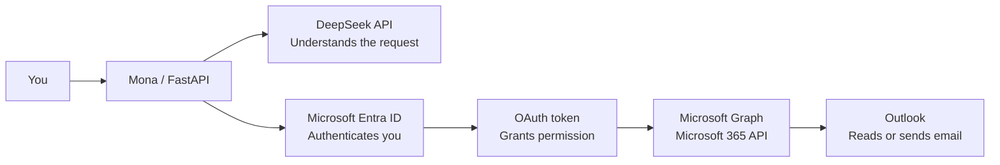

# Mona Learning Notes

## Services in simple terms

- **Azure account** — Gives access to Microsoft's cloud portal. The included trial credit is not needed for Mona's local email integration.
- **Microsoft Entra ID** — Formerly Azure Active Directory; manages identity, login, and application access.
- **App registration** — Registers Mona with Microsoft and gives Mona an application/client ID.
- **OAuth device-code flow** — Lets the user sign in through a browser without giving Mona the Outlook password.
- **OAuth token** — A temporary permission pass issued after successful sign-in.
- **Microsoft Graph** — Microsoft's API for connecting to Microsoft 365 services.
- **Outlook** — The mailbox where Mona can read, search, draft, reply to, and send email when permitted.
- **Mona** — The local personal AI-assistant application.
- **FastAPI** — Exposes Mona's local authentication, chat, and tool endpoints.
- **DeepSeek API** — Interprets the user's request and decides which approved Mona tool to use.
- **Mona mobile PWA** — A phone-friendly private interface for chat and approvals; the first local shell is implemented, but remote access is not enabled yet.
- **Device pairing** — A short, one-time code approves a browser and gives it a private revocable session without putting secrets in browser storage.
- **Tailscale** — Creates an encrypted private network between Mona's computer and approved phone; it does not make Mona public.
- **Tailscale Serve** — Gives the private tailnet an HTTPS address that securely forwards to Mona's localhost web port.

## Connection map



**Simple flow:** You ask Mona -> DeepSeek understands the request -> Entra verifies your identity -> Microsoft Graph performs the approved action in Outlook.

## Security model

- Entra handles authentication; it does not store the DeepSeek API key.
- Mona never needs the Outlook password.
- The LLM never receives Microsoft credentials and does not call Microsoft Graph directly.
- Microsoft permissions are delegated and limited to the signed-in user.
- Sending, replying, or changing email requires approval by default.
- Secrets belong only in the local `.env` file or the operating-system credential vault.
- Never commit `.env`, API keys, access tokens, refresh tokens, passwords, or credential files to Git.

## LLM and approval responsibilities

- The **LLM prepares a proposal** by converting natural language into a structured tool call: action, recipient, subject, and body.
- The **dispatcher validates and blocks** mutating proposals with `PENDING_APPROVAL`.
- The **user approves through Mona's trusted UI/API**, not by giving authority to the LLM.
- After approval, the backend executes the exact reviewed parameters through the tool and Microsoft Graph. The LLM must not rewrite the approved action.
- Phase 1 manually resubmits the reviewed tool call with `approval_status=APPROVED`.
- A future UI should store an immutable pending action server-side, display its preview, and send only an approval ID when the user clicks **Approve**.

## Setup progress

- [x] Outlook account available.
- [x] DeepSeek API key available and stored locally.
- [x] Azure free account created with trial credit.
- [x] Opened the default Microsoft Entra ID tenant, confirmed its Overview page is accessible, and renamed its display name from `Default Directory`.
- [x] Registered Mona with account type `Any Entra ID Tenant + Personal Microsoft accounts`.
- [x] Enabled Mona's public-client flow for device-code authentication.
- [x] Configured Microsoft Graph delegated permissions: `User.Read`, `Mail.ReadWrite`, and `Mail.Send`.
- [x] Added the application/client ID to the local `.env` file and kept `MS_TENANT_ID=common`.
- [x] Selected DeepSeek as Mona's active LLM provider in `.env`.
- [x] Started Mona locally and verified `/health` reports both Microsoft authentication and the LLM as configured.
- [x] Completed the Microsoft browser sign-in and consent step for Mona's device-code flow.
- [x] Resolved the HTTP 500 caused by Windows Credential Manager rejecting the oversized MSAL cache (`WinError 1783`). Mona now stores the cache as safe-sized, versioned chunks in the same OS vault.
- [x] Started and completed a fresh device-code flow; Mona returned `"authenticated": true` and securely stored the Microsoft token cache.
- [x] Verified DeepSeek through `POST /chat`; Mona returned `Mona is online.` with no tool results.
- [x] Authenticated through Microsoft's device-code flow and persisted the token securely.
- [x] Started Mona and completed the first read-only email chat with summaries of up to three unread messages.
- [x] Prepared the first outbound email action and verified the approval gate returned `PENDING_APPROVAL`; nothing was sent.
- [x] Sent the first outbound email through Microsoft Graph after explicit final approval.
- [x] Built the first mobile PWA shell and connected its readiness screen to Mona's local backend through a safe server-side health route.
- [x] Verified the mobile shell with a production build, lint check, and rendered-page test.
- [x] Fixed the Windows local-preview failure that loaded HTML without styling. Mona's local launcher now serves its built CSS and JavaScript directly, with an automated asset test.
- [x] Visually confirmed the corrected Mona home screen: Mona is online and all three readiness checks show `Ready`.
- [x] Added the device-pairing gate. Unapproved browsers cannot access Mona's private API routes; pairing codes expire after 10 minutes and work once.
- [x] Kept device records local and Git-ignored, storing only hashes of pairing codes and session tokens.
- [x] Paired the first browser and added an authenticated mobile-UI list of all paired devices, with the current browser clearly marked.
- [x] Installed Tailscale on the Windows PC and verified the PC is online in its private tailnet.
- [x] Connected the phone to the same tailnet.
- [x] Enabled persistent Tailscale Serve HTTPS for Mona's localhost web port while leaving Funnel disabled.
- [x] Opened Mona through private HTTPS on the phone and paired the phone browser.
- [x] Paired both `Santhosh_Laptop` and `Santhosh_Phone`; the authenticated device list now shows two approved devices.
- [x] Added a secure Chat tab for paired devices. Its same-origin server route validates bounded input and forwards requests to Mona's localhost `/chat` endpoint without exposing FastAPI directly.

## Manual private-link startup

```powershell
# Terminal 1: start Mona's backend; keep this window open.
Set-Location "C:\Users\kummaris.S-TKP-LTP-0343\OneDrive\M4rinqu3ll_GitHub_Repos\Mona_AI_Assistant"
.\.venv\Scripts\python.exe -m uvicorn agent.app:app --host 127.0.0.1 --port 8000

# Terminal 2: start Mona's mobile web app; keep this window open.
Set-Location "C:\Users\kummaris.S-TKP-LTP-0343\OneDrive\M4rinqu3ll_GitHub_Repos\Mona_AI_Assistant\web"
& "$env:USERPROFILE\.cache\codex-runtimes\codex-primary-runtime\dependencies\node\bin\node.exe" .\scripts\start-local.mjs

# Administrator terminal: enable the persistent private HTTPS proxy.
& "C:\Program Files\Tailscale\tailscale.exe" serve --bg 3000

# Display the private URL and confirm its proxy target.
& "C:\Program Files\Tailscale\tailscale.exe" serve status

# Optional: disable only Mona's private proxy.
& "C:\Program Files\Tailscale\tailscale.exe" serve --https=443 off
```

`serve --bg` persists across Tailscale restarts. Normally, later daily starts require only the backend and mobile-web commands.

## Current next step

Restart the local mobile web process so it loads the new build, then use the Chat tab from a paired device for the first read-only Outlook request. Add immutable approval records before enabling approval-controlled email sending in the mobile UI.
