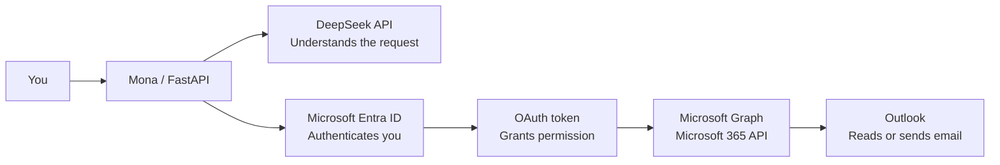

# Mona Learning Notes

## Services in simple terms

- **Azure account** — Gives access to Microsoft's cloud portal. The included trial credit is not needed for Mona's local email integration.
- **Microsoft Entra ID** — Formerly Azure Active Directory; manages identity, login, and application access.
- **App registration** — Registers Mona with Microsoft and gives Mona an application/client ID.
- **OAuth device-code flow** — Lets the user sign in through a browser without giving Mona the Outlook password.
- **OAuth token** — A temporary permission pass issued after successful sign-in.
- **Microsoft Graph** — Microsoft's API for connecting to Microsoft 365 services.
- **Outlook** — The mailbox where Mona can read, search, draft, reply to, and send email when permitted.
- **Mona** — The local personal AI-assistant application.
- **FastAPI** — Exposes Mona's local authentication, chat, and tool endpoints.
- **DeepSeek API** — Interprets the user's request and decides which approved Mona tool to use.

## Connection map

**Simple flow:** You ask Mona -> DeepSeek understands the request -> Entra verifies your identity -> Microsoft Graph performs the approved action in Outlook.

## Security model

- Entra handles authentication; it does not store the DeepSeek API key.
- Mona never needs the Outlook password.
- The LLM never receives Microsoft credentials and does not call Microsoft Graph directly.
- Microsoft permissions are delegated and limited to the signed-in user.
- Sending, replying, or changing email requires approval by default.
- Secrets belong only in the local `.env` file or the operating-system credential vault.
- Never commit `.env`, API keys, access tokens, refresh tokens, passwords, or credential files to Git.

## Setup progress

- [x] Outlook account available.
- [x] DeepSeek API key available and stored locally.
- [x] Azure free account created with trial credit.
- [ ] Open the default Microsoft Entra ID tenant and confirm its Overview page is accessible.
- [ ] Register Mona as a public-client application.
- [ ] Configure Microsoft Graph delegated permissions.
- [ ] Add the application/client ID to the local `.env` file.
- [ ] Authenticate through Microsoft's device-code flow.
- [ ] Start Mona and test the first read-only email chat.
- [ ] Test an email draft/send action with explicit approval.

## Current next step

Open [Azure Portal](https://portal.azure.com), search for **Microsoft Entra ID**, open it, and select **Overview**. Do not create another tenant yet.
