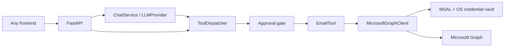

# Mona AI Assistant

A production-oriented Phase 1 foundation for Mona, an extensible personal AI assistant. Outlook email is the first
connector, not the architecture: the LLM reasons, the dispatcher authorizes and routes, tools own
business behavior, and clients own external API details.

## What is included

- MSAL device-code OAuth with the serialized token cache stored in the OS credential vault
- Async Microsoft Graph client with bounded responses, retries, and structured failures
- Generic `BaseTool` and `ToolDispatcher` contracts
- Outlook email actions: unread, read, search, send, reply, mark read, and attachment retrieval
- Approval-aware mutating actions (manual by default; optional Phase 1 auto-approval)
- FastAPI endpoints: `/health`, `/tools`, `/tool`, `/chat`, and device-code authentication
- Swappable `LLMProvider` abstraction with an OpenAI implementation
- Provider-neutral memory interface, with long-term storage intentionally not implemented
- Structured JSON logs with tool name, action, duration, error code, and correlation ID

## Architecture



The LLM never receives credentials and never calls Microsoft Graph directly. Tool results are
bounded to the requested messages or attachment, rather than exposing a whole mailbox.

See [the detailed architecture](docs/architecture.md),
[development guide](docs/development.md), and [roadmap](docs/roadmap.md).

## Installation

Prerequisites: Python 3.12+, [uv](https://docs.astral.sh/uv/), a Microsoft Entra public-client
application, and (for `/chat`) an OpenAI API key.

```powershell
uv sync --extra dev
Copy-Item .env.example .env
```

In Microsoft Entra ID, enable public client flows and grant delegated permissions `User.Read`,
`Mail.ReadWrite`, and `Mail.Send`. Put only the application/client ID in `.env`; never add a client
secret for this public device-code flow.

Set at minimum:

```dotenv
MS_CLIENT_ID=your-application-client-id
MS_TENANT_ID=common
```

To enable chat reasoning:

```dotenv
LLM_PROVIDER=openai
OPENAI_API_KEY=your-api-key
OPENAI_MODEL=gpt-5.6-sol
OPENAI_REASONING_EFFORT=low
```

Start the API:

```powershell
uv run uvicorn agent.app:app --reload
```

Open `http://127.0.0.1:8000/docs`. Start authentication with
`POST /auth/device-code`, follow its browser instruction, then submit the returned `flow_id` to
`POST /auth/device-code/{flow_id}/complete`.

## API examples

Read-only tool calls execute immediately:

```json
POST /tool
{
  "tool": "email",
  "action": "get_unread",
  "parameters": {"limit": 5}
}
```

Mutating calls return `PENDING_APPROVAL` by default. Resubmit the exact reviewed call with
`"approval_status": "APPROVED"`, or set `AUTO_APPROVE_TOOLS=true` only in a trusted Phase 1
environment.

```json
POST /chat
{
  "message": "Show my five most recent unread messages",
  "history": []
}
```

## Quality checks

```powershell
uv run ruff check .
uv run mypy agent
uv run pytest
```

## Security notes

- Refresh tokens remain inside MSAL's serialized cache, persisted through the operating system
  credential manager via `keyring`.
- Secrets are loaded from the environment and `.env` is ignored by Git.
- Graph payloads and tool outputs should be treated as untrusted content.
- The API currently assumes a trusted local caller. Add API authentication and durable approval
  storage before exposing it beyond localhost.
