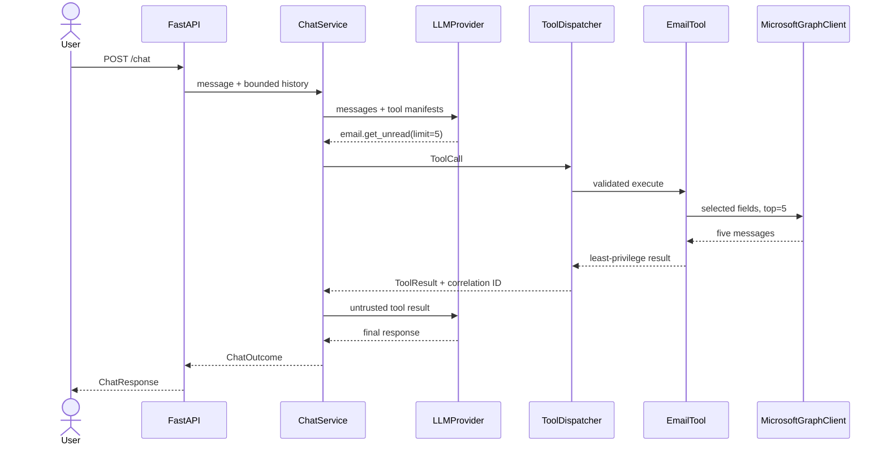
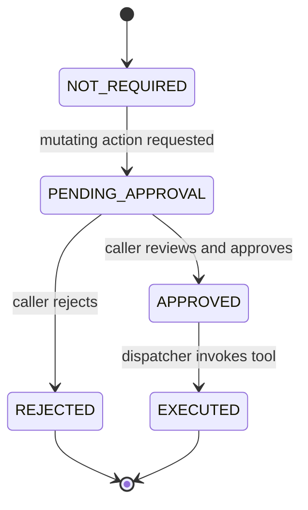
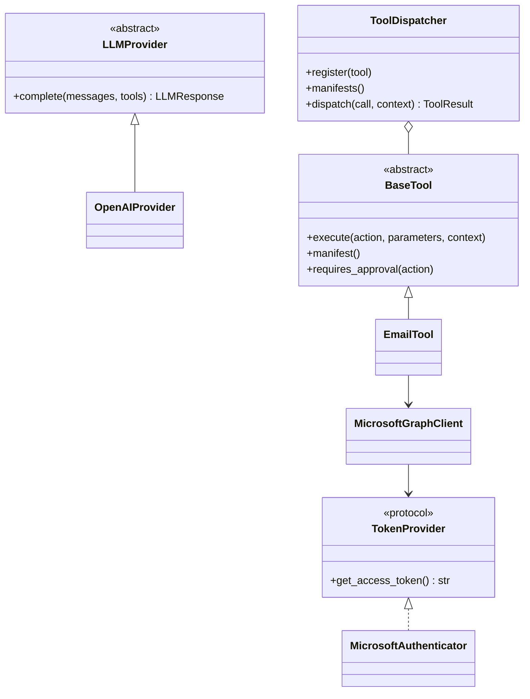

# Architecture

## Responsibilities

| Layer | Owns | Must not own |
|---|---|---|
| API | HTTP validation and response models | Outlook or LLM business rules |
| Chat service | Provider-neutral reasoning loop | External API credentials |
| LLM provider | Model-specific request/response mapping | Tool execution |
| Dispatcher | Registration, routing, approval, errors, timing | Connector business logic |
| Tool | Actions and parameter models | OAuth and raw HTTP |
| Client | External API protocol and retries | LLM prompts or approval policy |
| Authentication | OAuth flow and token cache | Email behavior |

## Request sequence

## Approval sequence

`AUTO_APPROVE_TOOLS=true` moves a mutating action through approval automatically. It is a temporary
Phase 1 deployment option, not a durable human-approval system.

## Core classes

## Adding another connector

1. Create Pydantic parameter models for each action.
2. Implement `BaseTool`, declaring `name`, `action_schemas`, and `mutating_actions`.
3. Keep protocol-specific HTTP and authentication in a client module.
4. Register the tool in `build_container`.

No dispatcher, API, chat-service, or LLM-provider change is required.

